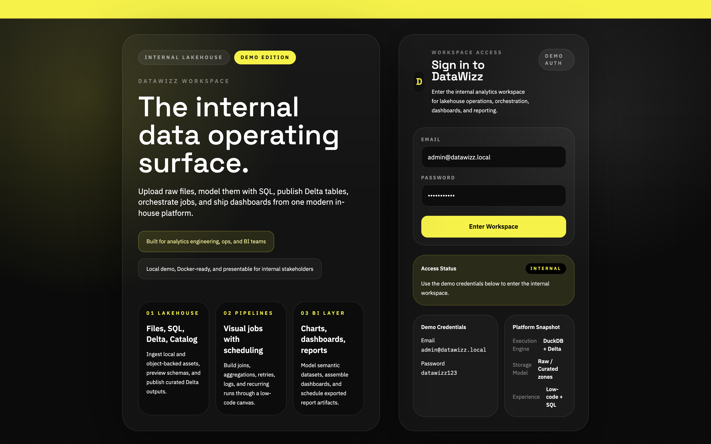
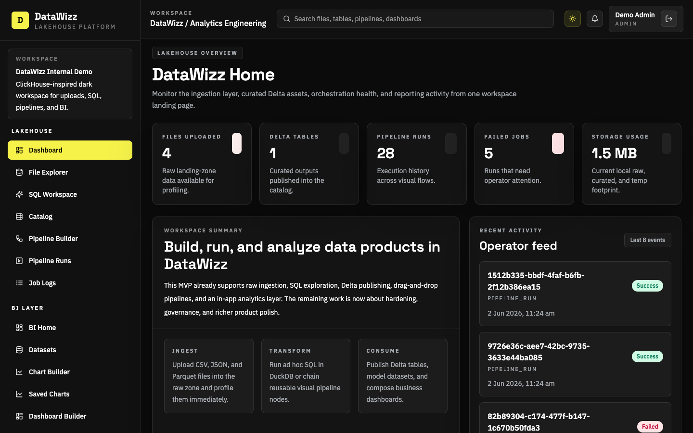
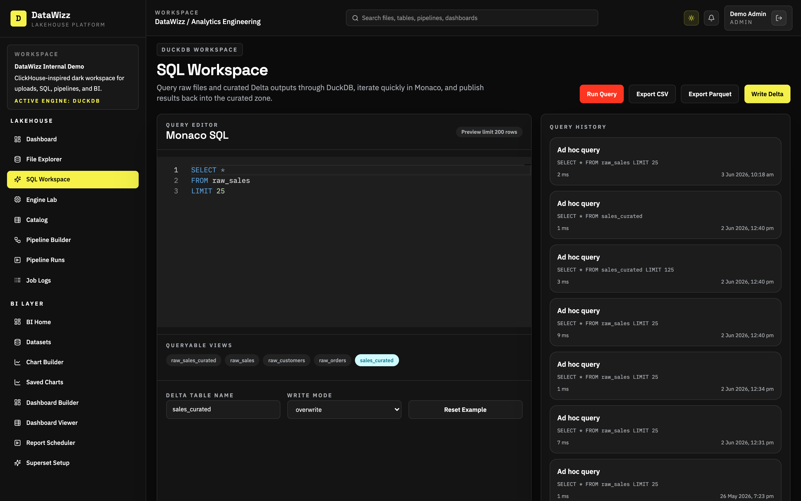
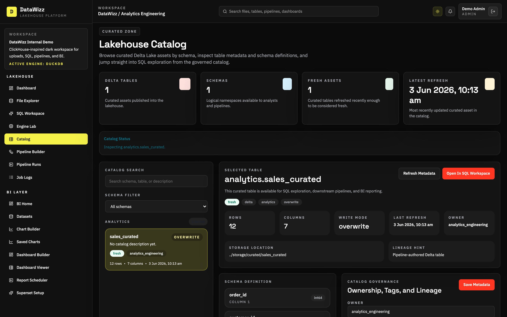
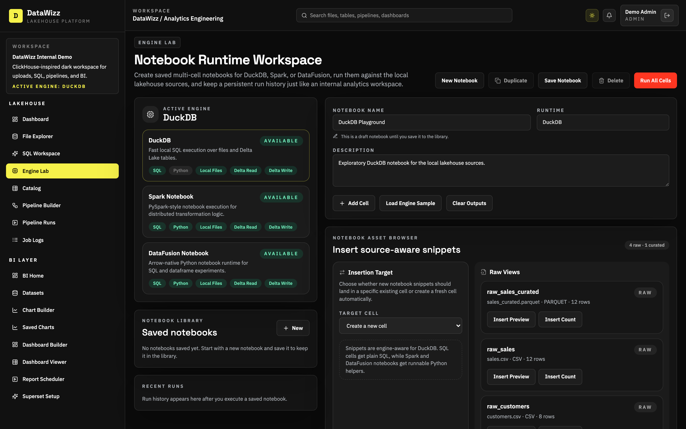
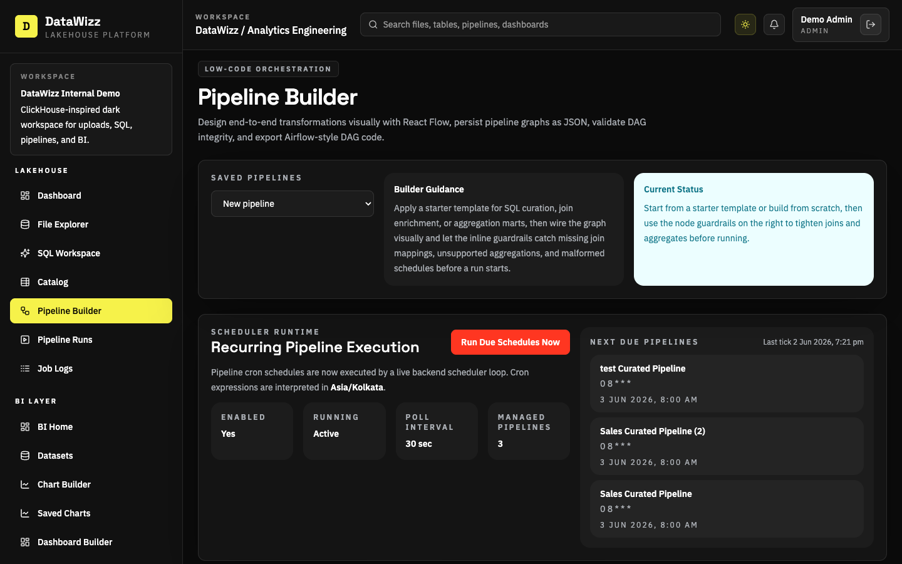
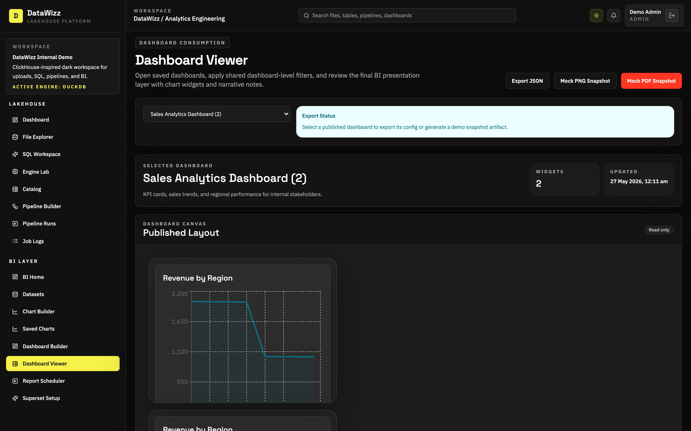

<div align="center">

**A lakehouse, orchestration, and BI workspace for modern analytics teams.**

[](http://localhost:5173)
[](./backend)
[](./frontend)
[](./backend)
[](./storage)
[](./frontend)

</div>

DataWizz is a data platform inspired by Databricks, Snowflake, ClickHouse Cloud, Airflow, Superset, and Metabase. It combines file ingestion, SQL exploration, Delta Lake publishing, multi-engine notebooks, low-code orchestration, and business dashboards in one local-first workspace.

The current version is intentionally built as a serious MVP rather than a toy demo:

- Upload, preview, and profile raw files
- Query raw and curated data with DuckDB
- Run notebooks with DuckDB, PySpark, and DataFusion
- Publish transformed outputs as Delta tables
- Build and validate visual pipelines
- Track runs, retries, and logs
- Create semantic datasets, charts, dashboards, and scheduled reports
- Embed Superset and auto-provision a shared DataWizz analytics connection
- Switch between dark and light workspace themes
- Run locally with one script or as a Docker demo stack

## Product Tour

<table>
  <tr>
    <td colspan="2">
      
    </td>
  </tr>
  <tr>
    <td colspan="2"><strong>Workspace access</strong><br/>A polished dark-mode entry experience with demo credentials, platform positioning, and a more presentation-ready first impression.</td>
  </tr>
  <tr>
    <td width="50%">
      
    </td>
    <td width="50%">
      
    </td>
  </tr>
  <tr>
    <td><strong>Lakehouse home</strong><br/>Monitor files, Delta assets, pipeline health, and workspace activity from a single landing page.</td>
    <td><strong>SQL workspace</strong><br/>Query raw files and curated outputs, inspect history, and write results back to Delta Lake.</td>
  </tr>
  <tr>
    <td width="50%">
      
    </td>
    <td width="50%">
      
    </td>
  </tr>
  <tr>
    <td><strong>Curated catalog</strong><br/>Browse governed Delta assets with ownership, freshness, schema, and preview data.</td>
    <td><strong>Notebook runtime lab</strong><br/>Build saved multi-cell notebooks, switch between DuckDB, Spark, and DataFusion, insert source-aware snippets, and persist per-cell outputs.</td>
  </tr>
  <tr>
    <td width="50%">
      
    </td>
    <td width="50%">
      
    </td>
  </tr>
  <tr>
    <td><strong>Pipeline builder</strong><br/>Design low-code flows, validate graph rules, schedule recurring runs, and export Airflow-style DAGs.</td>
    <td><strong>BI dashboard layer</strong><br/>Publish chart-driven dashboards, apply shared filters, and generate JSON or mock snapshot exports for stakeholder-ready reporting surfaces.</td>
  </tr>
</table>

## Why DataWizz

DataWizz is designed for analytics engineering and platform demos where you want a believable lakehouse product surface without needing a full distributed stack on day one.

It is especially useful when you want to demonstrate:

- Raw-to-curated data workflows
- SQL-first transformation on local or object-backed files
- Notebook-driven prototyping across multiple execution engines
- Delta Lake publishing with metadata tracking
- Airflow-like orchestration without leaving the app
- In-app BI dashboards on top of curated outputs

## Core Capabilities

### Lakehouse

- File upload, preview, schema inference, and deletion
- SQL querying over CSV, JSON, Parquet, and curated Delta tables
- Write query outputs to Delta Lake with append or overwrite modes
- Catalog browsing with metadata, freshness, ownership, tags, and lineage hints
- Theme-aware workspace shell with dark and light presentation modes

### Notebook Runtime

- Multi-cell saved notebooks in the `Engine Lab`
- Real local execution for DuckDB, PySpark, and DataFusion
- Run-all, run-single-cell, and run-from-here execution flows
- Notebook duplicate, delete, rename, and run history support
- Source-aware asset browser with one-click SQL or Python snippet insertion
- Persisted per-cell outputs so reopened notebooks restore the latest visible state

### Orchestration

- Visual pipeline builder powered by React Flow
- File source, Delta source, filter, select, join, aggregate, SQL, validate, write, and schedule nodes
- DAG validation, node guardrails, run history, retries, and detailed logs
- Airflow DAG code generation and export
- Backend recurring scheduler for saved cron pipelines

### BI Layer

- Semantic dataset explorer
- Dataset-driven chart builder
- Saved chart library with traceability into dashboards and report schedules
- Dashboard builder and dashboard viewer
- Report scheduler with stored artifacts and snapshot history
- Optional Superset integration surface for demo storytelling

## Architecture

See the deeper system walkthrough in [docs/architecture.md](./docs/architecture.md).

At a high level:

```text
Users
  -> React + TypeScript frontend
  -> FastAPI application layer
  -> DuckDB execution services
  -> Delta Lake curated storage
  -> PostgreSQL metadata store
  -> Optional MinIO object storage
```

Project layout:

```text
frontend/           React app for the workspace UI
backend/            FastAPI APIs, services, models, and migrations
docs/               Architecture, API, demo workflow, and screenshots
sample_data/        CSV fixtures and sample pipeline JSON
storage/            raw/, curated/, and temp/ runtime zones
docker-compose.yml  Demo stack for frontend, backend, PostgreSQL, MinIO, Superset
run.sh              One-command local launcher
```

## Quick Start

### One command

From the project root:

```bash
./run.sh
```

This launcher:

- Reuses healthy local frontend and backend processes when they are already running
- Starts the app in local demo mode when Docker is unavailable
- Starts the managed Superset runtime automatically by default
- Can bootstrap Superset natively without Docker when Docker is unavailable
- Supports a Docker-based stack when Docker is installed

Local endpoints:

- App: `http://localhost:5173`
- API: `http://localhost:8000`
- API docs: `http://localhost:8000/docs`
- Embedded Superset page: `http://localhost:5173/bi/superset`

Demo credentials:

- Email: `admin@datawizz.local`
- Password: `datawizz123`

### Other launcher modes

```bash
./run.sh local
./run.sh local nosuperset
./run.sh local superset native
./run.sh local --restart
./run.sh auto nosuperset
./run.sh docker
./run.sh docker nosuperset
```

## Local Development

### Backend

```bash
cd backend
python3 -m venv .venv
source .venv/bin/activate
pip install -e '.[dev]'
cp .env.example .env
uvicorn app.main:app --reload --host 0.0.0.0 --port 8000
```

Notes:

- The backend targets PostgreSQL by default.
- For quick local demos, the launcher can use SQLite-backed metadata automatically.

### Frontend

```bash
cd frontend
npm install
cp .env.example .env
npm run dev
```

## Docker Demo Stack

```bash
docker compose up --build
```

Included services:

- Frontend
- FastAPI backend
- PostgreSQL
- MinIO
- Optional Superset profile

Optional Superset:

```bash
./run.sh
# force the no-Docker runtime
./run.sh local superset native
# skip Superset when you want only the core workspace
./run.sh local nosuperset
```

## Demo Flow

For a complete scripted walkthrough, see [docs/demo-workflow.md](./docs/demo-workflow.md).

Suggested first demo:

1. Upload `sample_data/sales.csv` and `sample_data/customers.csv`
2. Query `raw_sales` in the SQL workspace
3. Write `sales_curated` as a Delta table
4. Open the catalog and inspect the curated asset
5. Open `Engine Lab` and run a DuckDB, Spark, or DataFusion notebook cell
6. Run the sample visual pipeline
7. Build charts and review the published BI dashboard

## Sample SQL

Regional revenue:

```sql
SELECT
  region,
  SUM(revenue) AS total_revenue
FROM raw_sales
GROUP BY region
ORDER BY total_revenue DESC;
```

Monthly revenue:

```sql
SELECT
  strftime(order_date, '%Y-%m') AS month,
  SUM(revenue) AS total_revenue
FROM raw_sales
GROUP BY 1
ORDER BY 1;
```

Top customers:

```sql
SELECT
  customer_id,
  SUM(revenue) AS total_revenue
FROM raw_sales
GROUP BY customer_id
ORDER BY total_revenue DESC
LIMIT 10;
```

## Documentation

- [Architecture](./docs/architecture.md)
- [API documentation](./docs/api.md)
- [Demo workflow](./docs/demo-workflow.md)

## Verification

This repo has been locally verified with:

- `python3 -m compileall backend/app backend/alembic`
- `npm run build`
- backend smoke checks for file upload, SQL execution, Delta writes, notebook runtime flows, pipelines, BI flows, and report scheduling

## Current MVP Notes

- DuckDB remains the primary SQL workspace engine
- Spark and DataFusion are available through the notebook runtime surface
- Delta publishing is implemented through the backend write services
- Scheduling is now active in-app for saved cron pipelines
- Notebook outputs persist per cell and restore when a notebook is reopened
- The BI layer is intentionally lightweight and app-native; Superset is now available as an embedded managed runtime with an auto-provisioned shared DuckDB connection

## Roadmap Status

### Completed

- Real login, sessions, seeded users, and role-aware API and UI RBAC for `admin`, `analyst`, and `viewer`
- Dark and light workspace themes with a polished shared shell, search, and page-level UX cleanup
- File Explorer drag-and-drop uploads, schema and row preview, deep column profiling, and profile-driven recommendations
- SQL Workspace querying, export, and Delta publishing backed by DuckDB
- Catalog governance editing, quality and freshness signals, data contract guardrails, lineage relationships, and mini lineage graph drill-down
- Visual pipeline builder validation, join and aggregation guardrails, retries, logs filtering, and recurring scheduler execution
- Engine Lab notebooks with DuckDB, PySpark, and DataFusion runtimes, saved snippets, collaboration basics, and persisted cell outputs
- BI dataset explorer, chart builder, saved charts, dashboard builder and viewer, filters, and report scheduler with stored artifacts
- Embedded Superset runtime with a shared serving catalog and auto-provisioned `DataWizz Serving Catalog` connection

### Next

- Flink streaming support
- Great Expectations quality checks
- OpenLineage integration
- Hive Metastore or Nessie-backed catalog options
- Notebook export artifacts and richer collaboration flows
- Natural-language chart generation
- Dashboard sharing and permissions
- Row-level security and column masking
- Semantic metrics layer
- Alerts, subscriptions, and richer export delivery
- CI/CD, monitoring, and Kubernetes deployment

---

DataWizz is built to show what a modern internal analytics platform can look like when lakehouse workflows, orchestration, and BI are treated as one cohesive product surface.
