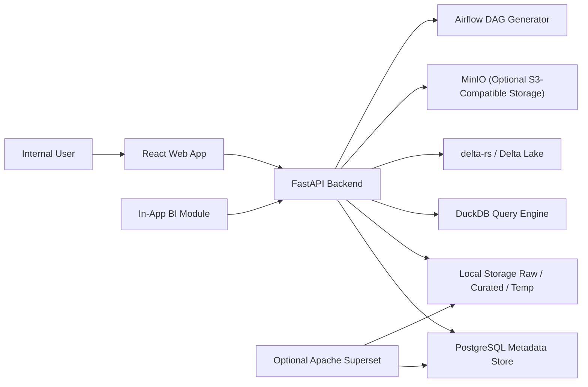

# Internal Lakehouse Platform Architecture

## Goal

The MVP delivers an internal, demo-ready lakehouse platform that combines:

- File ingestion into a raw zone
- SQL querying over files and curated Delta tables with DuckDB
- Delta Lake writes powered by `delta-rs`
- Visual pipeline authoring and manual execution
- Operational metadata persisted in PostgreSQL
- A lightweight BI layer for charts and dashboards

## Architectural Principles

- Clean separation between UI, API, execution engine, and metadata store
- Local-first developer experience with Docker support for demos
- Open-source execution path that can evolve toward Spark, Flink, Trino, or Airflow later
- Modular services so ingestion, SQL, orchestration, and BI can grow independently

## System Context



## Monorepo Layout

```text
frontend/              React + TypeScript + Tailwind + React Flow + Monaco
backend/               FastAPI app, services, metadata models, migrations
docker/                Compose assets and service configs
docs/                  Architecture, API docs, demo instructions
sample_data/           Demo CSV files and sample pipeline JSON
storage/
  raw/                 Uploaded source files
  curated/             Delta Lake tables
  temp/                Temporary query outputs and exports
```

## Backend Modules

### API Layer

- `files`: upload, list, preview, schema inference, delete
- `queries`: execute SQL, persist history, export results
- `tables`: list and preview Delta tables
- `pipelines`: save/load pipelines, validate graph, execute manually
- `runs`: pipeline runs and logs
- `bi`: datasets, charts, dashboards, report schedules
- `system`: dashboard metrics, health, configuration snapshot

### Service Layer

- `StorageService`: file paths, uploads, deletes, storage accounting
- `DuckDBService`: runtime SQL execution and file registration
- `DeltaService`: write/read/list Delta Lake tables
- `PipelineService`: DAG validation, topological execution, logging
- `MetadataService`: shared CRUD helpers for persisted entities
- `BiService`: chart query previews, dashboard persistence
- `AirflowDagService`: Python DAG code generation from pipeline JSON

### Persistence Layer

Metadata lives in PostgreSQL and includes:

- users
- uploaded_files
- delta_tables
- queries
- pipelines
- pipeline_runs
- job_logs
- semantic_datasets
- charts
- dashboards
- dashboard_widgets
- report_schedules

## Execution Model

### File Querying

1. User uploads CSV, JSON, or Parquet into `storage/raw`
2. Backend stores metadata in PostgreSQL
3. DuckDB registers the raw file as a logical view
4. SQL editor queries raw files or curated Delta tables

### Delta Writes

1. SQL result is materialized as Arrow or pandas
2. Backend writes the result into `storage/curated/<table_name>` using `write_deltalake`
3. Table metadata and schema are stored in PostgreSQL
4. The table becomes queryable in the catalog and SQL workspace

### Pipeline Execution

1. User defines a pipeline graph in the visual builder
2. Pipeline graph is stored as JSON plus normalized metadata
3. Manual execution validates the DAG and computes topological order
4. Each node reads from upstream outputs or source assets
5. Transform nodes compile to DuckDB SQL
6. Write nodes publish Delta tables and persist catalog metadata
7. Logs and statuses are recorded per run

## BI Layer

The in-app BI module is intentionally lightweight in the MVP:

- datasets map to Delta tables or saved SQL
- charts persist configuration and rendering metadata
- dashboards store widget layout and chart references
- chart preview queries execute through DuckDB

Optional Superset integration is documented, but not required for the in-app MVP flow.

## Future-Ready Extension Points

- Spark or DataFusion execution engines behind the query interface
- MinIO-backed object storage paths and credentials
- Airflow API trigger integration
- Great Expectations validation nodes
- OpenLineage event emission
- Trino or Nessie integration for richer lakehouse metadata

## MVP Boundaries

Included in this first version:

- File upload, preview, delete, and schema inference
- SQL execution with DuckDB
- Write query results to Delta Lake
- Delta catalog browsing
- Visual pipeline builder with manual execution
- Pipeline runs and logs
- Basic BI module with datasets, charts, and dashboards
- Docker Compose setup for frontend, backend, PostgreSQL, and MinIO

Deferred but documented as TODOs:

- auth/RBAC
- advanced scheduling and Airflow execution
- Spark/Flink engines
- production observability and Kubernetes deployment
